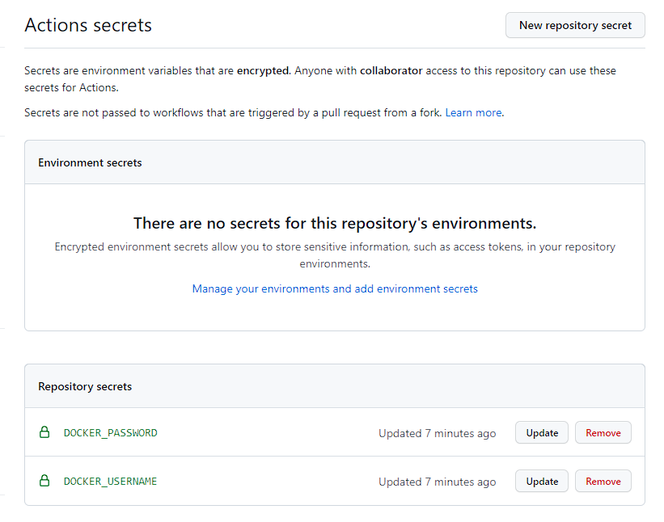
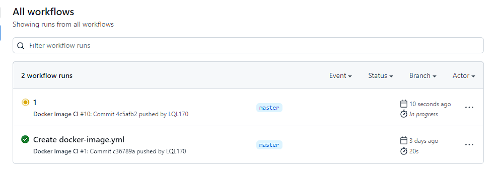
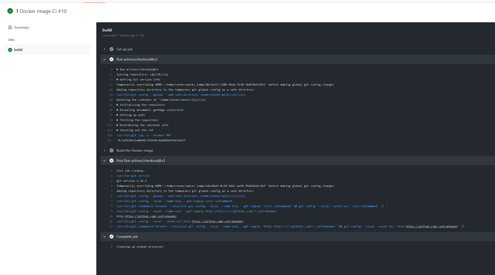
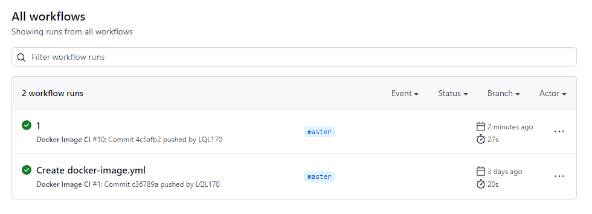
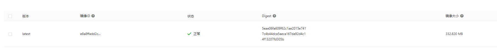

# `GITHUB` 模拟线上打包并推送镜像至远程仓库

1. 在 `github` 上创建好仓库，推送相关代码

   1. `Dockerfile` 配置

      ```Dockerfile
        FROM node:16

        ENV TZ=Asia/Shanghai
        ENV  DEBIAN_FRONTEND=noninteractive

        RUN apt install -y tzdata
        RUN ln -fs /usr/share/zoneinfo/${TZ} /etc/localtime
        RUN echo ${TZ} > /etc/timezone
        RUN dpkg-reconfigure --frontend noninteractive tzdata

        WORKDIR /app

        COPY ./package.json /app/package.json
        COPY ./build /app/build

        RUN npm -g install pnpm
        RUN pnpm i --production

        CMD ["node", "build"]
      ```

   2. `github` `workflows` 配置

      ```yml
       name: Docker Image CI

       on:
       push:
           branches: ["master"]
       pull_request:
           branches: ["master"]

       jobs:
       build:
           runs-on: ubuntu-latest

           steps:
           - uses: actions/checkout@v3
           - name: Build the Docker image
               run: |
               docker login --username=${{ secrets.DOCKER_USERNAME }} --password=${{ secrets.DOCKER_PASSWORD }} registry.cn-beijing.aliyuncs.com
               docker build . --file .server.Dockerfile --tag lily_demo
               docker tag lily_demo registry.cn-beijing.aliyuncs.com/medomino_demo/lily_demo
               docker push registry.cn-beijing.aliyuncs.com/medomino_demo/lily_demo
      ```

   3. 密钥设置

      

2. 推送代码，触发线上打包, 推送至远程仓库

   1. 正在打包

      

   2. 打包成功日志

      

   3. 打包成功

      

   4. 推送镜像成功

      
